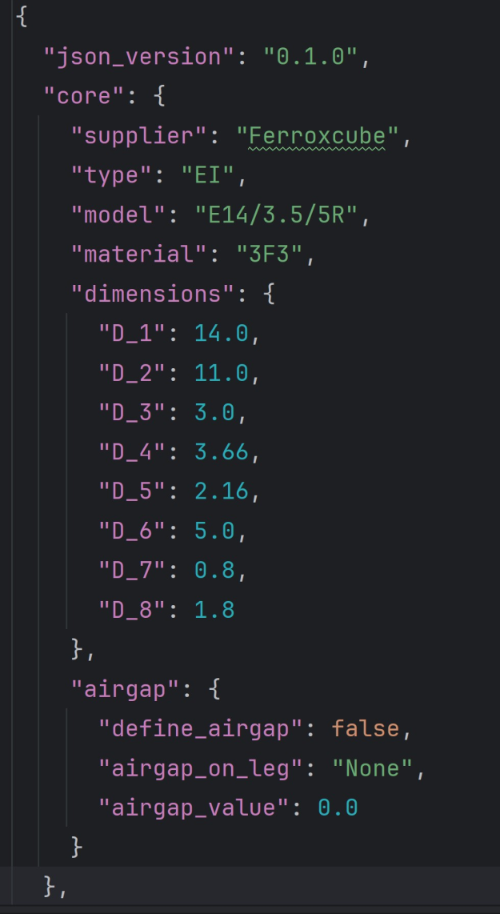

.. _act_to_pyetk_example:

Use the PyETK UI to migrate an ACT JSON file to a PyETK JSON file
=================================================================

This example shows how to migrate an existing ACT JSON file for ETK to a PyETK JSON file.

#. Verify that you have a valid ACT JSON file.

   This file contains the configuration and settings for your transformer.
   The ACT JSON file does not include a version. Its structure contains three main sections: ``core_dimensions``, ``winding_definitions``, and ``setup_definitions``.
   It looks like this:

   .. image:: ../_static/act-toolkit-json.svg
      :align: center
      :width: 400
      :alt: UI start page tab

#. Open the PyETK UI and click the cube icon to display the **Transformer Builder** tab.

#. Click **Open** and select your ACT JSON file to load it into PyETK.

   PyETK automatically parses the ACT JSON file and populates the fields in the UI with the
   corresponding values from the ACT JSON file.

#. Review the populated fields in the UI to confirm that all the information transferred
   correctly.

#. If you want to reuse this configuration file, click **Save As** to save it in the latest
   working JSON format.

   .. image:: ../_static/load-act-json.svg
      :align: center
      :width: 800
      :alt: Transformer Builder tab

   .. note::
      The log provides information about the loading process, including any errors or warnings that may occur during the migration.

PyETK's versioned JSON file resembles the original ACT JSON configuration file.
However, it has a more structured format, with clear sections for core dimensions, winding definitions, and setup definitions. This structure makes it easier to navigate and understand the different components of the transformer configuration.

The version number in the PyETK JSON file helps to track changes and updates to the file format over time. It allows updates and improvements, including new features, without breaking compatibility with existing files.