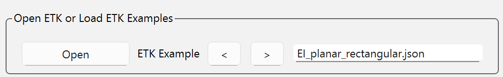

.. _ui_example:

Create transformer using the user interface
============================================

This example demonstrates how to use the PyETK's User Interface (UI) to create an electronic transformer.
It provides a step-by-step guide on how to navigate through the UI, specify settings,
and design a transformer using the available fields and tools.

The design is that of a planar transformer, which is commonly used in power electronics applications.

    .. image:: ../_static/planar-transformer.png
         :align: center
         :width: 400
         :alt: Planar transformer

For simplicity, the example focuses on one sub-menu at a time, starting with the core model, dimensions, and materials.
Then, moving to the bobbin, winding, and excitation information, and finally, the Maxwell settings.

#. First, launch the PyETK, and connect to AEDT by clicking the **Connect to AEDT** button under the settings tab.
   For installation instructions, see :ref:`installation`.

    .. image:: ../_static/pyetk-toolkit-settings.png
        :align: center
        :width: 800
        :alt: Settings tab

#. Next, navigate to the **Transformer Builder** tab. This tab contains all the fields and tools to design and model electronic transformers.

    .. image:: ../_static/menu-builder-tab.png
        :align: center
        :width: 800
        :alt: Transformer Builder tab

#. Modify the core information in the **Core** section by selecting the core type, core dimensions, and core material.

    .. image:: ../_static/menu-core.png
        :align: center
        :width: 600
        :alt: Transformer Builder tab

    .. note::
         The **Custom Core** checkbox enables the user to use a standard core shape with custom dimensions.

#. Then, modify the board information in the **Bobbin and Margin** section by selecting the bobbin type and bobbin dimensions.

    .. image:: ../_static/menu-bobbin-margin.png
        :align: center
        :width: 350
        :alt: Bobbin Margin Menu

    .. note::
        In PyETK the names bobbin and board are interchangeable. **Bobbin** is used to refer to *Wound* build types, while **Board** is used to refer to *Planar* build types. The fields in the UI are the same for both build types.

#. Modify the electrical source information such   as the excitation type, excitation value, and frequency.

    .. image:: ../_static/menu-electrical.png
        :align: center
        :width: 350
        :alt: Excitation Menu

#. Create the transformer windings layer by layer by specifying the build type, material, number of turns, and turn spacing for each layer in the **Winding** section.

    * The **Winding** section is initialized as follows:

    .. image:: ../_static/menu-winding.png
        :align: center
        :width: 600
        :alt: Winding Menu

    .. warning::
        The Transformer cannot be created without at least a single winding layer. Hence, the initialization of the winding section contains one layer with default values.
        The user can modify the default values or add more layers as needed. In addition, layer connection must be specified. By default, every layer in a winding side is connected in **Series**

        To modify the circuit connections between layers, the user must select the layers of interest, click the **Disconnect** button and then specify either **Series** or **Parallel** connection.
        The user can also specify the connection between the primary and secondary sides by selecting the **Primary-Secondary Connection** button and selecting either **Series** or **Parallel** connection between them.
        See image below for more details.

        .. image:: ../_static/menu-winding-2.png
            :align: center
            :width: 600
            :alt: Winding Layers and Connections

        After disconnecting the default connection

        .. image:: ../_static/menu-winding-3.png
            :align: center
            :width: 600
            :alt: Winding Layers and Connections Disconnected

        Connecting the layers in parallel

        .. image:: ../_static/menu-winding-4.png
            :align: center
            :width: 600
            :alt: Winding Layers and Connections Parallel

    * Create the winding layers and connections for the planar transformer as follows:

    .. image:: ../_static/menu-winding-5.png
        :align: center
        :width: 600
        :alt: Winding Menu Planar

#. Specify the Maxwell settings such as the number of passes, percent error, maximum number of passes, and frequency sweeps.

    .. image:: ../_static/menu-settings.png
        :align: center
        :width: 350
        :alt: Maxwell Settings Menu

    .. note::
        The Maxwell settings are used to specify the settings for the Maxwell analysis that is performed after creating the transformer geometry in AEDT. These settings are used to control the accuracy and convergence of the Maxwell analysis.

#. Finally, click **Create Transformer** to create the transformer geometry in AEDT. The log window provides information about the creation process, including any errors or warnings that may occur during the process.

    .. image:: ../_static/menu-save-create.png
        :align: center
        :width: 600
        :alt: Create and Save Transformer Button

    .. note::
        The current transformer model can be saved as a .json file by clicking on the **Save As** button. This allows the user to save the current configuration of the transformer and load it later for further modifications or analysis. The saved .json file contains all the information about the core, bobbin, winding, excitation, and Maxwell settings that were specified in the UI.

Pre-packaged examples - Loading a transformer model from a .json file
---------------------------------------------------------------------

To enable third party integration, PyETK consumes a transformer definition defined in a versioned .json file.
This .json contains all the information including sources, dimensions, materials, and other advanced settings.
The .json configuration file can be used with PyETK's API, bypassing the need for the UI.

The .json file can be created by saving the current transformer model in the UI using the **Save As** button, or it can be created manually by following the structure of the .json file.

To browse through the pre-packaged examples, you have two options either click the **Open** button, or navigate using the forward and backward buttons as shown in the image below.

.. note::
    If you were an ACT ETK user, you can load your ACT .json file in the PyETK UI by clicking on the **Open** button and selecting your ACT .json file.
    The PyETK automatically parses the ACT .json file and populate the fields in the UI with the corresponding values from the ACT .json file. After loading the ACT .json file, you can review the populated fields in the UI to ensure that all the information has been correctly transferred.
    If you're planning on reusing the configuration file, click *Save As*.
    This way the ACT .json file is saved in the latest working .json format. See :ref:`act_to_pyetk_example` for more details on migrating from ACT to PyETK.
