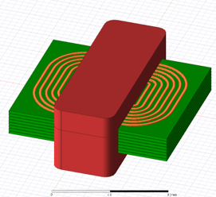

.. _ui_example:

Create a transformer model in AEDT using the PyETK UI
=====================================================

This example shows how to use the PyETK UI to create a transformer model in AEDT.
It guides you through specifying settings and designing a transformer using
the available fields and tools.

The design is for a planar transformer, which is commonly used in power
electronics applications.

For simplicity, the example covers one submenu at a time, starting with the core model, dimensions, and materials. It then moves to the bobbin, winding, and excitation information and concludes with Maxwell settings.

#. Launch the PyETK UI and connect to AEDT by clicking **Connect to AEDT**.
For PyETK installation instructions, see :ref:`installation`.

   .. image:: ../_static/pyetk-toolkit-settings.png
      :align: center
      :width: 800
      :alt: UI settings

#. In the upper left corner of the UI, click the cube icon to display the
**Transformer Builder** tab.

   This tab contains all the fields and tools to design and model electronic transformers.

   .. image:: ../_static/menu-builder-tab.png
      :align: center
      :width: 800
      :alt: Transformer Builder tab

#. In the **Core** area, select the core type, dimensions, and material. Select the **Custom Core** checkbox to apply a standard core shape with custom dimensions.

   .. image:: ../_static/menu-core.png
      :align: center
      :width: 600
      :alt: Transformer Builder tab

#. In the **Board and Margin** area, specify the thickness and margins in millimeters.

   .. image:: ../_static/menu-bobbin-margin.png
      :align: center
      :width: 350
      :alt: Board and Margin area

   .. note::
    In PyETK, the terms *board* and *bobbin* are interchangeable. *Board* refers to a planar build type, while *bobbin* refers to a wound build type. The fields in the UI are the same for both types.

#. In the **Electrical** area, modify the electrical source information, such as frequency,
   excitation strategy, and excitation value.

   .. image:: ../_static/menu-electrical.png
       :align: center
       :width: 350
       :alt: Excitation menu

#. In the **Winding** area, create the transformer windings layer by layer by specifying
   the build type, material, number of turns, and turn spacing for each layer.

   The **Winding** area initializes as follows:

   .. image:: ../_static/menu-winding.png
       :align: center
       :width: 600
       :alt: Winding menu

   .. important::
    The transformer requires at least one winding layer. The winding section initializes with one layer containing default values. You can modify these values or add more layers as needed. Additionally, you must specify the layer connection. By default, every layer in a winding side connects in series.

    To modify the circuit connections between layers, select the layers of interest, click **Disconnect**, and then choose either **Series** or **Parallel** as the connection. You can also specify the connection between layers of each winding side by clicking **Side <number>** in the top Winding menu,
    and selecting either **Series** or **Parallel** to connect the layers in the bottom Winding/Connection menu.

    .. image:: ../_static/menu-winding-2.png
        :align: center
        :width: 600
        :alt: Winding layers and connections

    After disconnecting, the default connection appears as follows:

    .. image:: ../_static/menu-winding-3.png
        :align: center
        :width: 600
        :alt: Winding layers and connections disconnected

    Connect the layers in parallel:

    .. image:: ../_static/menu-winding-4.png
        :align: center
        :width: 600
        :alt: Winding layers and connections in parallel

#. Create the winding layers and connections for the planar transformer as shown:

   .. image:: ../_static/menu-winding-5.png
       :align: center
       :width: 600
       :alt: Winding menu Planar

#. In the **Settings** pane on the left, specify Maxwell settings, including the
   number of passes, percentage error, maximum number of passes, and frequency sweeps.

    Maxwell settings control the accuracy and convergence of the Maxwell analysis performed after creating the transformer geometry in AEDT.

   .. image:: ../_static/menu-settings.png
       :align: center
       :width: 350
       :alt: Settings pane for Maxwell analysis

#. Click **Create Transformer** to create the transformer geometry in AEDT.

   .. image:: ../_static/menu-save-create.png
       :align: center
       :width: 600
       :alt: Save As and Create Transformer buttons

   .. note::
    Clicking **Save As** saves all information about the core, bobbin, winding, excitation, and Maxwell settings to a JSON file. You can later open this file and make modifications.

The log displays information about the creation process, including any errors or warnings.

Pre-packaged examples: Load a transformer model from a JSON file
----------------------------------------------------------------

To enable third-party integration, PyETK uses a transformer definition stored in a versioned JSON configuration file. This file contains all the information, including sources, dimensions, materials, and advanced settings.

The JSON file can be used with the PyETK API, bypassing the UI.

To save the current transformer definition to a JSON file, click **Save As** in the UI. You can also create the JSON file manually by following the structure of an existing JSON file.

You can open or load a pre-packaged example in the PyETK UI:

- Click **Open** and select the JSON file.
- Use the forward and backward buttons to navigate through the JSON files.

.. image:: ../_static/menu-examples.png
    :align: center
    :width: 600
    :alt: Open and browse examples

.. note::
    If you used ACT ETK, you can load your ACT JSON file in the PyETK UI by clicking **Open** and selecting your ACT JSON file. PyETK automatically parses the ACT JSON file and populates the fields in the PyETK UI with the values from this file. Review the populated fields to ensure all information is correctly transferred. If you plan to reuse the configuration file, click **Save As** to save the information in the ACT JSON file to the latest working JSON format. For more information, see :ref:`act_to_pyetk_example`.
