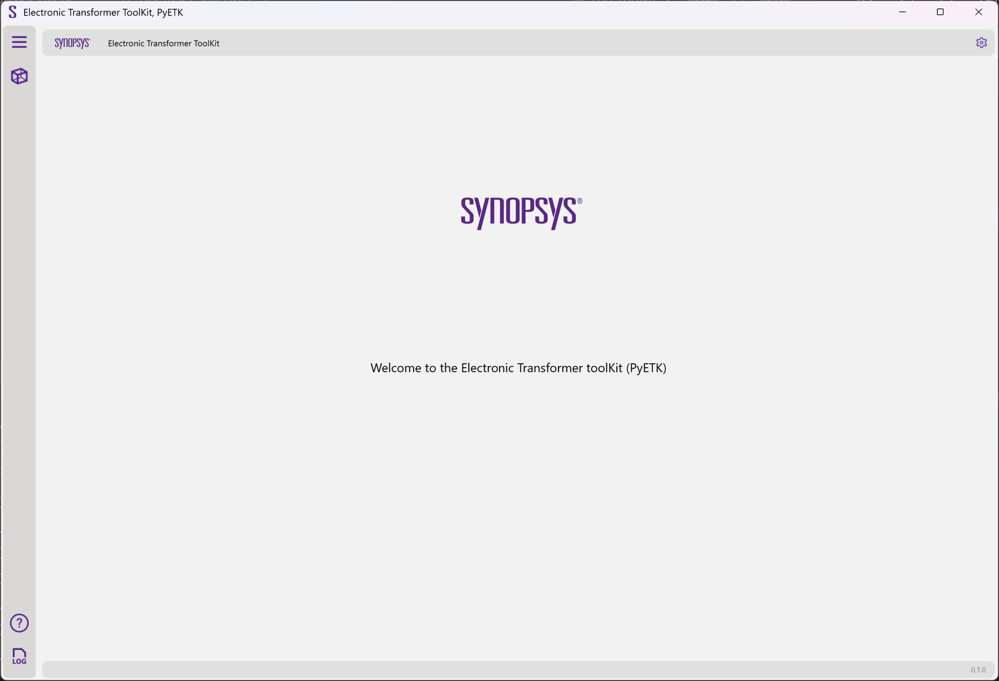
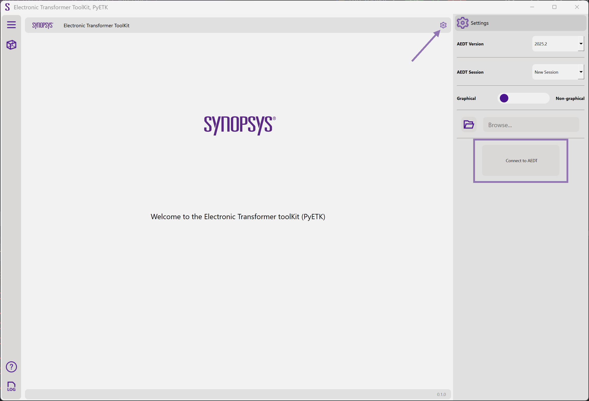
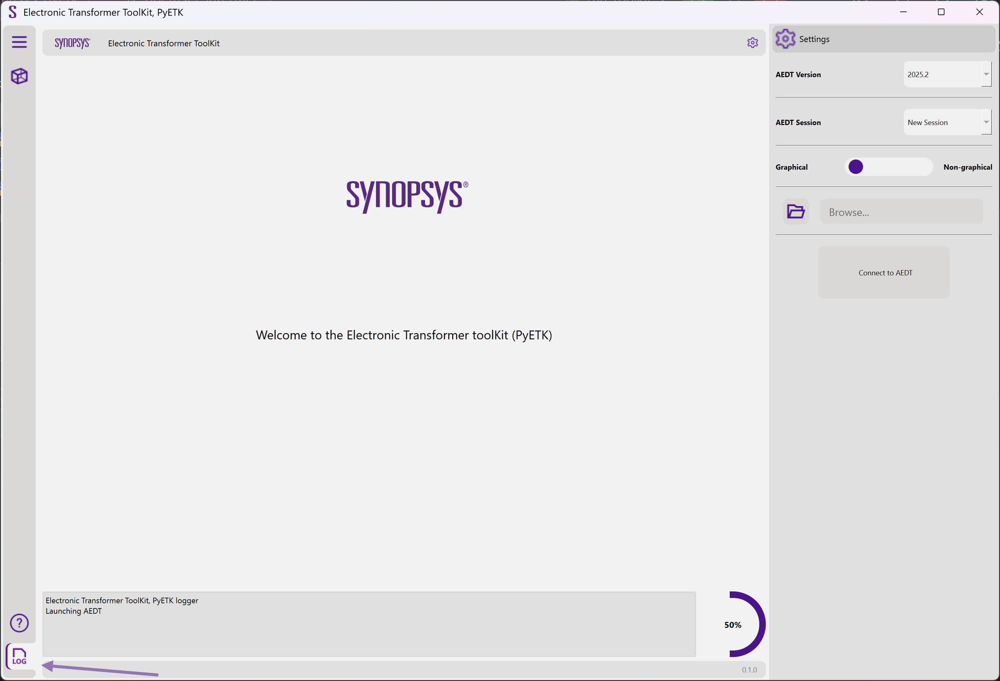
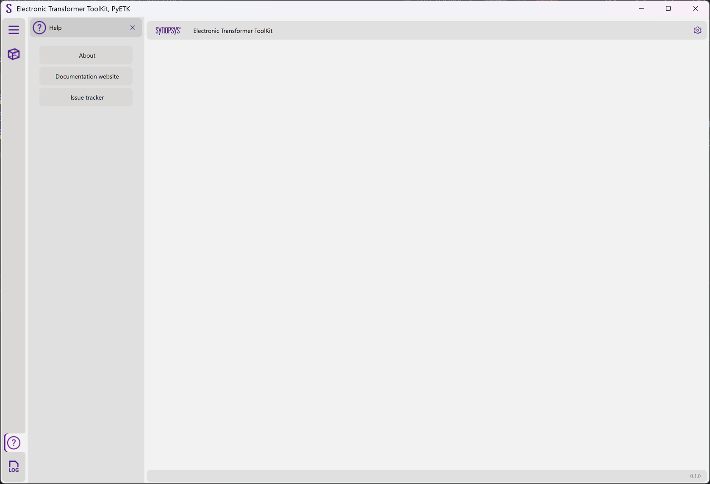

.. _common_framework:

Common framework
================

This page explains how to use the PyETK common framework, which is shared across all AEDT toolkits. It takes you through the UI, from the initial **Welcome** page to configuring settings and viewing logs and online help.

In the UI **Settings**, specify settings for either creating an AEDT session or
connecting to an existing AEDT session.

.. note::
   If the PyETK UI is launched from AEDT, the **Settings** icon does not appear
   because the toolkit is directly connected to the specific AEDT session.

In the lower left corner, click the **Log** icon to view general information about the toolkit's operations, such as the status of the connection to AEDT, the creation of geometries,
and any errors that might have occurred during the process.

In the lower left corner, click the **Help** icon to access information about your PyETK installation, PyETK documentation, and issues tracked in the GitHub repository.

